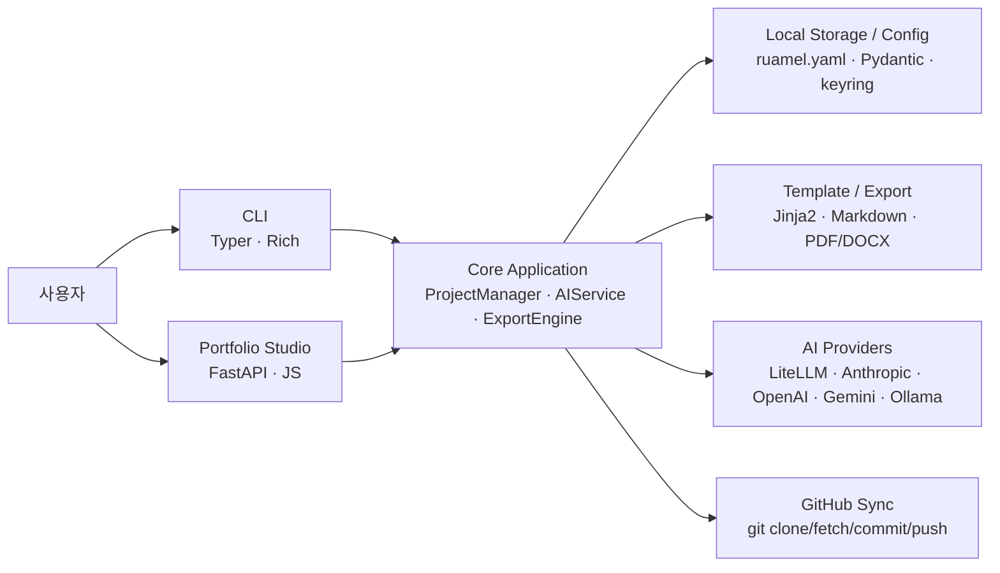

# DevFolio

개발자의 프로젝트 경험을 로컬에서 구조화해 관리하고, 같은 원천 데이터를 기반으로 이력서·포트폴리오·프로젝트 소개 문서를 재사용할 수 있도록 만든 로컬 우선 포트폴리오 스튜디오입니다. CLI와 웹 UI를 함께 제공해 데이터 입력 방식의 유연성을 확보했고, AI 기반 문구 생성, 다중 형식 내보내기, GitHub 백업 동기화까지 하나의 워크플로우로 연결했습니다.

## 한 줄 소개

구조화된 프로젝트 데이터를 중심으로 포트폴리오 작성, AI 문구 생성, 문서 렌더링, GitHub 백업까지 통합한 로컬 우선 개발자 문서 자동화 플랫폼

## 프로젝트 목적

기존 이력서 작성 도구는 결과 문서를 편집하는 데 초점이 맞춰져 있어, 프로젝트 내용을 수정할 때마다 이력서·포트폴리오·README를 각각 다시 고쳐야 하는 문제가 있었습니다. DevFolio는 이 문제를 해결하기 위해 프로젝트, 작업, 요약, 기술 스택을 구조화된 데이터로 먼저 저장하고, 그 데이터를 기반으로 다양한 출력 형식의 문서를 재사용할 수 있는 구조를 목표로 설계했습니다.

또한 개발자가 로컬 환경에서 자신의 커리어 데이터를 직접 통제할 수 있도록 로컬 우선 아키텍처를 채택했습니다. AI 기능은 선택적으로 연결하고, 원본 데이터와 생성 결과는 GitHub 동기화로 백업할 수 있게 만들어 문서 작성 생산성과 데이터 안전성을 함께 확보했습니다.

## 백엔드 개발자 관점에서 맡은 역할

- 프로젝트/작업 도메인 모델 설계와 검증 로직 구현
- YAML 기반 로컬 저장소와 서비스 계층 분리
- AI Provider 추상화, 모델 선택 정책, 생성 파이프라인 설계
- 웹 API와 CLI가 동일한 도메인 로직을 공유하도록 구조 정리
- 문서 템플릿 렌더링, 내보내기, GitHub 동기화 백엔드 구현
- 설정, API 키, 에러 처리, 로깅 등 운영 관점의 기반 기능 설계

## 해결한 문제와 방식

### 1. 이력서와 포트폴리오를 매번 다시 작성해야 하는 문제

문서 단위로 내용을 복사해 관리하면 한 프로젝트를 수정할 때 여러 산출물을 동시에 고쳐야 하고, 내용 불일치가 쉽게 발생합니다. 이를 해결하기 위해 `Project`, `Task`, `Period` 중심의 구조화된 데이터 모델을 설계하고, Pydantic 검증을 통해 CLI와 웹 UI 모두에서 동일한 데이터 규칙을 적용했습니다. 그 결과 한 번 입력한 프로젝트 데이터를 이력서, 포트폴리오, 단일 프로젝트 소개 문서로 재사용할 수 있는 기반을 만들었습니다.

### 2. 개발자 친화적인 입력 방식이 부족한 문제

일부 사용자는 터미널 기반 자동화 워크플로우를 선호하고, 일부는 브라우저에서 초안을 보고 수정하는 방식을 선호합니다. DevFolio에서는 Typer 기반 CLI와 FastAPI 기반 웹 스튜디오를 함께 제공하고, 두 인터페이스가 모두 동일한 서비스 계층을 사용하도록 구성했습니다. 이를 통해 입력 채널은 다르지만 저장 구조와 비즈니스 규칙은 일관되게 유지되도록 만들었습니다.

### 3. AI 문구 생성 결과의 품질과 일관성이 낮아질 수 있는 문제

단순히 한 번의 프롬프트 호출로 요약이나 bullet을 만들면 결과가 짧거나 추상적으로 흐르기 쉬웠습니다. 이를 개선하기 위해 프로젝트 데이터를 evidence 형태로 정리한 뒤, 초안 생성, 리뷰, 수정의 다단계 파이프라인을 적용했습니다. 또한 Provider별 generation-safe 모델 전략과 fallback 정책을 분리해, 동적 모델 목록과 실제 생성에 사용하는 안정 모델을 구분함으로써 운영 안정성까지 보완했습니다.

### 4. 결과 문서 형식이 다양할수록 유지보수가 어려워지는 문제

Markdown, HTML, PDF, DOCX 같은 여러 형식을 각각 별도 로직으로 관리하면 템플릿 중복과 변경 비용이 커집니다. DevFolio에서는 Jinja2 템플릿을 중심으로 문서 구성을 통합하고, export 엔진에서 형식별 변환만 담당하도록 책임을 분리했습니다. 이 방식으로 템플릿 수정이 전체 출력 형식에 일관되게 반영되도록 만들었습니다.

### 5. 로컬 데이터 관리와 백업이 분리되어 있는 문제

문서와 원본 데이터가 여기저기 흩어져 있으면 백업과 복원이 번거롭고, 작업 이력을 추적하기도 어렵습니다. 이를 해결하기 위해 GitHub sync 서비스를 추가해 원본 데이터와 생성 산출물을 별도 저장소에 커밋하고 push하는 흐름을 지원했습니다. 로컬 우선 구조를 유지하면서도 백업과 버전 관리를 연결한 점이 핵심입니다.

## 기술 스택

| 분류 | 기술 | 사용 목적 |
|---|---|---|
| Backend / Core | Python | 전체 애플리케이션 로직, 서비스 계층, 문서 생성 및 동기화 기능 구현 |
| CLI | Typer, Rich | 명령형 워크플로우 제공, 초기 설정/프로젝트 관리/내보내기 등 CLI 경험 개선 |
| Web API | FastAPI, Uvicorn | Portfolio Studio, 설정 관리, 미리보기, AI 생성, Git 스캔용 REST API 제공 |
| Data Modeling | Pydantic | 프로젝트, 작업, 설정, 초안 모델 검증과 직렬화 |
| Storage | ruamel.yaml, platformdirs | YAML 기반 로컬 저장소 구성, 사용자 환경별 설정/데이터 경로 관리 |
| Security | keyring, 환경변수 폴백 | API 키 보관과 실행 환경별 보안 처리 |
| Templating | Jinja2, Markdown | 이력서/포트폴리오/프로젝트 문서 템플릿 렌더링 |
| Export | WeasyPrint, python-docx | HTML/PDF/DOCX 등 다중 형식 내보내기 |
| AI Integration | LiteLLM, Anthropic/OpenAI/Gemini/Ollama | Provider 추상화와 AI 기반 문구 생성 |
| Sync / Ops | Git, GitHub, Docker | 로컬 개발 환경 표준화, 백업 동기화, 배포 및 실행 환경 단순화 |
| Frontend | JavaScript, HTML, CSS | 웹 스튜디오 UI, 설정 화면, 미리보기, 에러 팝업, 다이어그램 렌더링 |

## 아키텍처

## 백엔드 관점 핵심 구현 포인트

### 도메인 중심 구조

프로젝트와 작업 이력을 단순 텍스트가 아니라 구조화된 도메인 모델로 다루도록 설계했습니다. `ProjectManager`가 생성, 수정, 저장, 초안 변환 등 핵심 비즈니스 로직을 담당하고, 저장소 접근은 별도 storage 계층으로 분리해 책임을 명확히 나눴습니다. 이 구조 덕분에 웹 UI와 CLI가 같은 규칙을 공유하면서도 구현이 복잡하게 얽히지 않도록 유지할 수 있었습니다.

### 로컬 우선 저장소 설계

DevFolio는 외부 SaaS에 의존하지 않고 사용자의 로컬 파일 시스템을 중심으로 동작합니다. 프로젝트 데이터는 YAML로 저장하고, 설정 파일과 동기화 상태도 분리된 경로에 관리하도록 구성했습니다. 이 방식은 사용자가 자신의 커리어 데이터를 직접 통제할 수 있게 해주며, 동시에 백업이나 복원도 파일 단위로 수행할 수 있게 해줍니다.

### AI 생성 파이프라인 안정화

AI 기능은 단순 문장 생성이 아니라, 실제 프로젝트 데이터를 근거로 더 설득력 있는 포트폴리오 문구를 만들기 위한 보조 도구로 설계했습니다. 이를 위해 프롬프트를 코드에서 분리하고, evidence 기반 입력, 초안 생성, 리뷰, 재작성 흐름을 적용했습니다. 또한 Provider별 generation-safe 모델 정책과 fallback 후보를 두어, 저장된 모델명이 바뀌거나 preview 모델이 불안정할 때도 전체 기능이 쉽게 깨지지 않도록 대응했습니다.

### 문서 렌더링과 형식 확장성

문서 출력은 템플릿과 export 엔진으로 역할을 나눠 설계했습니다. 템플릿에서는 프로젝트 요약, 기술 스택 구성, 문제/해결/성과, 아키텍처 다이어그램 같은 포트폴리오 콘텐츠를 정의하고, export 엔진은 HTML/PDF/DOCX 등 형식별 변환을 담당합니다. 이 구조 덕분에 출력 형식을 추가하거나 템플릿을 확장할 때 핵심 비즈니스 로직을 건드리지 않고도 변경할 수 있습니다.

### 동기화와 운영 관점 설계

개인 프로젝트라도 지속적으로 수정되는 문서와 데이터를 안정적으로 관리하려면 백업 체계가 필요합니다. DevFolio에서는 GitHub sync 서비스를 통해 원본 데이터와 생성 산출물을 별도 저장소에 동기화하도록 만들었습니다. 또한 로그 레벨 제어, 경로 검증, Git 명령 실패 처리, Docker 기반 실행 환경 제공 등 운영 측면의 안정성도 함께 고려했습니다.

## 백엔드 포트폴리오에서 강조할 수 있는 포인트

- 데이터 입력 채널은 CLI와 웹 UI로 나뉘지만, 도메인 로직과 저장 규칙은 하나의 서비스 계층으로 통합해 일관성을 유지한 점
- 텍스트 문서 작성 문제를 구조화된 데이터 모델과 템플릿 렌더링 문제로 재정의해 재사용성과 유지보수성을 높인 점
- AI 기능을 단순 호출이 아니라 모델 선택 정책, 프롬프트 구조화, 리뷰 파이프라인까지 포함한 운영 가능한 백엔드 기능으로 설계한 점
- Markdown, HTML, PDF, DOCX, JSON, CSV까지 확장 가능한 export 구조를 만들어 문서 생산 시스템으로 발전시킨 점
- 로컬 우선 구조와 GitHub 백업 동기화를 결합해 데이터 통제권과 복원 가능성을 함께 확보한 점

## 포트폴리오용 요약 문구

DevFolio는 개발자의 프로젝트 경험을 구조화된 데이터로 관리하고, 같은 원천 데이터를 바탕으로 이력서·포트폴리오·프로젝트 소개 문서를 재사용할 수 있도록 만든 로컬 우선 포트폴리오 스튜디오입니다. Python 기반 서비스 계층 위에 CLI와 FastAPI 웹 UI를 함께 구성해 입력 채널을 유연하게 제공했고, Pydantic과 YAML 저장소를 이용해 데이터 일관성을 유지했습니다. 또한 LiteLLM 기반 AI 생성 파이프라인, Jinja2 중심의 문서 렌더링, PDF/DOCX 내보내기, GitHub 백업 동기화까지 통합해 단순 문서 편집기가 아닌 개발자용 문서 자동화 플랫폼으로 확장했습니다.

## 면접에서 설명할 때의 포인트

- 왜 문서 편집 문제가 아니라 데이터 구조화 문제로 접근했는지
- CLI와 웹 UI가 같은 백엔드 서비스를 공유하도록 설계한 이유
- AI Provider 모델 변경과 운영 불안정을 어떻게 흡수했는지
- 템플릿, export, sync를 분리해 유지보수성을 어떻게 확보했는지
- 개인 포트폴리오 도구를 운영 가능한 제품 구조로 확장한 과정에서 어떤 백엔드 판단을 했는지
