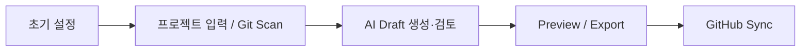
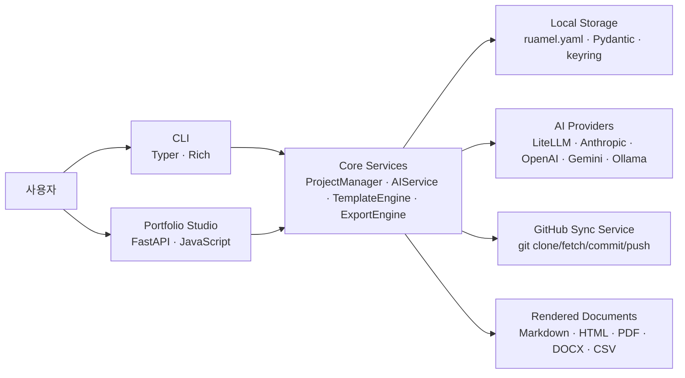

# DevFolio

## 한 줄 소개

구조화된 커리어 데이터를 중심으로 포트폴리오 작성, AI 문구 생성, 문서 렌더링, GitHub 백업까지 연결한 로컬 우선 개발자 문서 자동화 플랫폼

## 왜 만들었는지

기존 이력서와 포트폴리오 작성 방식은 결과 문서를 직접 고치는 데 초점이 맞춰져 있어, 하나의 프로젝트 경험이 여러 문서에 중복 입력되고 수정 시점도 쉽게 어긋납니다. DevFolio는 이 문제를 해결하기 위해 프로젝트, 작업, 기술 스택, 요약을 먼저 구조화된 데이터로 저장하고, 그 데이터를 바탕으로 이력서·포트폴리오·프로젝트 소개 문서를 재사용할 수 있도록 설계했습니다.

또한 커리어 데이터는 외부 SaaS에 종속되기보다 사용자가 직접 통제할 수 있어야 한다고 판단해 로컬 우선 아키텍처를 채택했습니다. 여기에 AI 문구 생성, Git 저장소 스캔, GitHub 백업 동기화를 선택적으로 연결해 단순 문서 편집기가 아니라 “개발자 경험 데이터 운영 도구”에 가까운 제품으로 확장했습니다.

## 어떤 사용자 문제를 해결하는지

- 같은 프로젝트 내용을 이력서, 포트폴리오, README마다 반복해서 다시 써야 하는 문제
- 자유 형식 메모와 실제 제출 문서 사이에 구조화 단계가 없어 내용이 자주 누락되는 문제
- AI를 활용해도 입력 데이터, 결과 검토, 최종 문서화가 하나의 흐름으로 이어지지 않는 문제
- 생성 결과와 원본 데이터를 함께 관리하기 어려워 백업과 재사용성이 떨어지는 문제
- CLI 기반 자동화와 웹 기반 편집 경험이 분리돼 있어 작업 방식에 따라 데이터가 달라지는 문제

## 목표와 범위

- 프로젝트, 작업, 기술 스택, 요약을 구조화된 원천 데이터로 저장하는 것
- 같은 데이터를 이력서, 포트폴리오, 프로젝트 소개 문서로 재사용하는 것
- 웹 Studio와 CLI가 같은 서비스 계층을 공유하도록 만드는 것
- AI draft 생성, preview, export, GitHub sync를 한 흐름으로 연결하는 것

이번 범위에서 의도적으로 피한 것은 “문서 편집기 자체를 고도화하는 것”이었습니다. DevFolio는 WYSIWYG 문서 편집기보다는 구조화된 데이터와 자동화 흐름에 더 집중했습니다.

## 사용 흐름

1. `devfolio init` 또는 설정 화면에서 사용자 정보, AI Provider, sync 옵션을 초기화합니다.
2. 사용자는 웹 Studio에서 자유 텍스트를 붙여넣거나, CLI/웹의 Git Scan으로 저장소 기반 프로젝트 초안을 만듭니다.
3. 초안은 구조화된 `Project / Task` 데이터로 정리되고, AI가 summary와 task bullet을 생성하되 사용자가 직접 검토하고 수정할 수 있습니다.
4. 저장 전에도 preview를 통해 Markdown/HTML 결과를 확인하고, 이후 PDF, DOCX, HTML, CSV 등 필요한 형식으로 export할 수 있습니다.
5. 필요 시 GitHub sync를 통해 원본 데이터와 생성 산출물을 별도 저장소에 백업해 버전 관리 흐름으로 연결합니다.

## 핵심 기능

- 자유 텍스트 intake와 Git Scan을 통한 구조화 초안 생성
- Project / Task 기반 데이터 저장과 웹-CLI 공용 서비스 계층
- AI summary, task bullet, case-study형 문구 생성
- Markdown/HTML/PDF/DOCX/CSV export
- GitHub sync를 통한 원본 데이터와 산출물 백업

## 시스템 아키텍처

DevFolio의 핵심은 CLI와 웹 UI가 별도 데이터 계층을 가지지 않고 같은 서비스 계층을 공유한다는 점입니다. `ProjectManager`가 프로젝트와 작업의 생성·수정·저장을 맡고, `AIService`는 provider 추상화와 문구 생성을 담당하며, `TemplateEngine`과 `ExportEngine`이 최종 문서 산출을 담당합니다. 이 구조 덕분에 입력 채널은 달라도 데이터 규칙과 결과물 품질을 일관되게 유지할 수 있습니다.

## 핵심 기술 스택과 선택 이유

| 분류 | 기술 | 선택 이유 |
|---|---|---|
| Core Backend | Python | CLI, 웹 API, 렌더링, 동기화까지 한 언어로 통합해 구현 복잡도를 낮추기 위해 선택 |
| CLI | Typer, Rich | 설정, CRUD, scan, export, sync 같은 명령형 워크플로우를 빠르게 제공하기 위해 사용 |
| Web API | FastAPI, Uvicorn | 로컬 Studio, preview, 설정, AI 기능을 가볍게 제공하는 serve-first 구조에 적합 |
| Data Model | Pydantic | 프로젝트/작업/설정 데이터를 강하게 검증하고 CLI와 웹 간 규칙을 통일하기 위해 사용 |
| Storage | ruamel.yaml, platformdirs | 사용자가 직접 읽고 관리할 수 있는 로컬 우선 저장소를 만들기 위해 YAML을 채택 |
| Secrets | keyring, env fallback | API 키를 평문 설정에 고정하지 않으면서 Docker/로컬 환경을 모두 지원하기 위해 사용 |
| Templating | Jinja2, Markdown | 같은 원천 데이터를 여러 문서 형식으로 재사용할 수 있는 템플릿 계층을 만들기 위해 사용 |
| Export | WeasyPrint, python-docx | 제출 문서 요구사항에 맞춰 PDF/DOCX까지 확장하기 위해 사용 |
| AI Integration | LiteLLM | Anthropic, OpenAI, Gemini, Ollama를 하나의 인터페이스로 추상화하기 위해 사용 |
| Sync / Ops | Git, GitHub, Docker | 로컬 실행, 백업, 재현 가능한 환경 구성을 단순화하기 위해 사용 |

## 주요 문제와 해결 방식

### 1. 문서 중심 관리로 인한 중복 수정 문제

이력서와 포트폴리오를 결과 문서 단위로 관리하면 같은 프로젝트를 여러 번 수정해야 하고, 내용 불일치가 쉽게 발생합니다. DevFolio에서는 `Project`, `Task`, `Period` 모델을 기준으로 데이터를 먼저 저장하고, 문서는 그 데이터를 렌더링한 결과로 취급하도록 구조를 바꿨습니다. 이 설계로 원천 데이터 한 번 수정으로 여러 산출물을 동시에 갱신할 수 있게 했습니다.

### 2. 자유 메모에서 제출 문서까지 이어지는 흐름 부재

개발자는 보통 프로젝트를 자유 형식 메모, 커밋 이력, README, 회고 텍스트로 남기기 때문에 바로 제출 문서로 쓰기 어렵습니다. 이를 해결하기 위해 웹 Studio intake와 Git Scan 기능을 도입해 자유 텍스트와 Git 저장소를 구조화된 draft로 전환하도록 만들었습니다. 그 다음 preview와 export를 바로 연결해 “입력 → 구조화 → 문서화” 흐름이 끊기지 않도록 했습니다.

### 3. AI 기능의 품질과 운영 안정성 문제

AI Provider를 단순 호출하면 모델명 변경, preview 모델 불안정, 결과 품질 편차 때문에 실제 제품 기능으로 운영하기 어렵습니다. DevFolio에서는 provider 추상화, generation-safe 모델 전략, fallback 후보, draft → review → revise 흐름을 도입해 AI 문구 생성이 단순 데모가 아니라 제품 기능으로 동작하도록 정리했습니다.

### 4. 다양한 문서 형식 지원 시 템플릿 중복 문제

Markdown, HTML, PDF, DOCX를 각각 따로 구현하면 유지보수 비용이 빠르게 증가합니다. 이를 줄이기 위해 Jinja2 템플릿 계층과 export 계층을 분리하고, 템플릿은 내용 구조를, export 엔진은 형식 변환을 담당하도록 역할을 나눴습니다. 이 방식으로 출력 형식이 늘어나도 핵심 문서 구조는 한 곳에서 관리할 수 있습니다.

### 5. 로컬 데이터와 백업 흐름의 분리 문제

로컬 우선 구조는 통제권이 높지만, 반대로 백업 자동화가 없으면 데이터 유실 위험이 있습니다. DevFolio에서는 GitHub sync 서비스를 통해 원본 데이터와 생성 산출물을 별도 저장소에 동기화하도록 만들었습니다. 그 결과 로컬 우선 철학을 유지하면서도 백업과 버전 관리 흐름을 제품 안에 포함시킬 수 있었습니다.

## 결과와 성과

- 구조화된 원천 데이터 한 번 수정으로 여러 문서 결과를 다시 생성할 수 있는 흐름을 만들었습니다.
- CLI와 웹 UI가 같은 서비스 계층을 공유해 입력 경로가 달라도 데이터 규칙이 일관되게 유지되도록 했습니다.
- AI 기능을 단순 데모가 아니라 provider 정책, fallback, review 흐름을 갖춘 백엔드 기능으로 정리했습니다.
- export와 sync를 연결해 작성, 검토, 배포, 백업이 하나의 제품 흐름으로 이어지게 했습니다.

## 백엔드 관점 핵심 구현 포인트

### 공용 서비스 계층

CLI와 웹 UI가 같은 `ProjectManager`를 사용하도록 구성해 입력 채널이 달라도 저장 규칙과 검증 로직이 달라지지 않게 했습니다. 이 선택은 기능이 늘어날수록 중복 구현을 줄이고, 유지보수 비용을 통제하는 데 핵심 역할을 했습니다.

### 구조화된 로컬 저장소

프로젝트 데이터를 YAML로 저장하되, Pydantic 모델을 통해 직렬화/검증 규칙을 강제했습니다. 사람이 읽을 수 있는 저장 형식을 유지하면서도, 코드에서는 강한 타입 검증과 일관된 데이터 구조를 확보했습니다.

### AI 서비스의 제품화

AI 호출을 단순 프롬프트 요청으로 두지 않고, 모델 선택 정책, fallback, 출력 품질 보정, provider 추상화를 포함한 서비스 계층으로 끌어올렸습니다. 이 설계를 통해 모델 교체나 provider 확장에도 도메인 로직이 직접 흔들리지 않도록 했습니다.

### 렌더링과 내보내기 분리

`TemplateEngine`은 내용을 문서 구조로 배치하고, `ExportEngine`은 HTML/PDF/DOCX 변환을 담당하게 분리했습니다. 이 덕분에 템플릿 수정과 출력 형식 추가를 서로 독립적으로 다룰 수 있습니다.

### 운영 가능한 로컬 제품 구조

`devfolio serve` 기반 웹 흐름, Docker 실행 지원, 로그 레벨 제어, GitHub sync, keyring/env 기반 비밀정보 관리까지 포함해 개인 툴 수준을 넘어 운영 가능한 로컬 제품 구조로 확장했습니다.

## 운영/확장성 관점 정리

- AI Provider는 추가되더라도 `AIService` 계층만 확장하면 되도록 분리했습니다.
- 문서 형식은 템플릿과 export 엔진 분리 덕분에 HTML/PDF/DOCX/CSV까지 확장 가능합니다.
- Git Scan, intake, preview, sync가 모두 같은 구조화 데이터 모델을 공유하므로 기능이 늘어나도 원천 데이터 일관성이 유지됩니다.
- 로컬 우선 구조라 사용자가 데이터 통제권을 유지하면서도, GitHub sync로 백업과 복원 전략을 가져갈 수 있습니다.

## 회고

- 문서 작성 문제를 “데이터 구조와 재사용 문제”로 재정의한 것이 프로젝트 방향을 선명하게 만들어줬습니다.
- 웹 UI와 CLI를 동시에 지원하면서도 백엔드 로직을 하나로 유지하는 설계가 장기 유지보수에 중요하다는 점을 확인했습니다.
- AI 기능은 결과 품질보다도 모델 정책, 예외 처리, fallback 같은 운영 설계가 실제 제품화의 핵심이라는 점을 배웠습니다.
- 다음 단계에서는 링크, 스크린샷, 다이어그램 같은 시각 자산을 더 쉽게 입력하고 보여주는 편집 흐름을 강화할 계획입니다.

## 링크 및 자산

- GitHub: [Lee-Kyuhwun/DevFolio](https://github.com/Lee-Kyuhwun/DevFolio)
- Demo: 로컬 실행 기반 제품이라 `devfolio serve` 또는 Docker 실행 흐름으로 확인 가능
- 다이어그램: 사용자 흐름, 시스템 아키텍처를 Mermaid 기반으로 문서와 preview에 직접 렌더링

## 면접에서 설명할 포인트

- 왜 문서 편집 문제가 아니라 구조화된 데이터 관리 문제로 접근했는지
- CLI와 웹 UI를 병행하면서도 서비스 계층을 하나로 유지한 이유
- AI 기능을 데모 수준이 아니라 운영 가능한 백엔드 기능으로 만든 방식
- export와 sync를 통해 “한 번 입력한 데이터를 여러 출력과 운영 흐름으로 재사용”하게 만든 설계 판단
- 로컬 우선 제품을 선택한 이유와, 그 약점을 GitHub sync와 구조화 저장소로 어떻게 보완했는지
